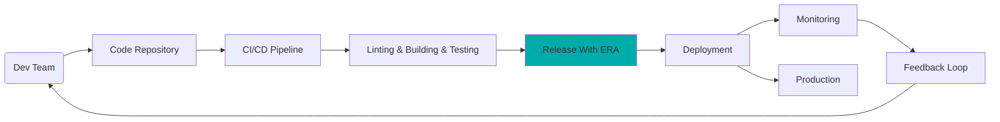

# ERA (**E**asy **R**elease **A**utomation)

ERA is an open-source tool designed to automatically tag multiple repositories.

It plays a crucial role in the DevOps cycle, specifically within the `Release step`,
where it ensures smooth and consistent tagging:



**Diagram 1:** _DevOps Cycle with ERA integration for Release Automation_

Our objective was to streamline the auto-tagging of 10 interdependent repositories
with a single click through a fully integrated CI pipeline.
This automation, achieved with the ERA tool, now saves us over **four hours per release** and
makes the release process convenient for us. Especially when for releasing multiple times per month.

ERA consists of the `easy-release-automation` CLI application which uses a `release-config.yml` file.
For an example, see [Release-Config Example](./era/release-config.yml).

ERA modifies, verifies, and tags the repositories defined in `release-config.yml`.
Plugins specified in `release-config.yml` execute these actions,
providing ERA with the flexibility to handle various use cases for automating the release process.

ERA currently requires two branches per repository. The default names are `main` and `stable`,
but these can be customized in `release-config.yml`.

The following three commit messages are automatically generated for each repository by ERA:

```bash
    Main branch (Merge Commit from stable into main)
    │
    ├─ chore: :wastebasket: ERA: Preparation for merging back into main with the plugin(s): changelog_unreleased_setter

    Stable branch (Commit for Tag 0.1.0)
    │
    ├─ chore: :bookmark: ERA: Release-Commit for Version: 0.1.0

    Stable branch (Commit for modification based on defined plugins in release-config.yml)
    │
    ├─ chore: :white_check_mark: ERA: Modification with the plugin(s): changelog_version_updater, yaml_updater
    │  and Validation with the plugin(s): validate_changelog 
```

## Table of Contents

- [ERA (**E**asy **R**elease **A**utomation)](#era-easy-release-automation)
  - [Table of Contents](#table-of-contents)
  - [What is ERA not?](#what-is-era-not)
  - [More Information About ERA?](#more-information-about-era)
  - [Feature Matrix](#feature-matrix)
  - [Getting Started](#getting-started)
  - [FAQ](#faq)
    - [What Should I Know Before Using ERA?](#what-should-i-know-before-using-era)
    - [Does ERA Natively Run On Windows?](#does-era-natively-run-on-windows)

## What is ERA not?

ERA is not responsible for the following tasks:

1. Building and deploying a package from the source code.
2. Integrating manual testing during the release process.
3. Testing created packages on end-devices or in cloud environment.

A good place for these tasks is a CI pipeline (see Diagram 1).

## More Information About ERA?

- [How does ERA work?](./doc/overview.md)

## Feature Matrix

- [Feature Matrix](./doc/features.md)

## Getting Started

- [ERA Getting Started](./doc/getting_started.md)
- [ERA Project Integration Guide](./doc/project_integration.md)

## FAQ

### What Should I Know Before Using ERA?

- Basics of using Git
- Basics of GitFlow

### Does ERA Natively Run On Windows?

ERA is primarily developed and used on Linux developer machines (see `scripts/setup-era.sh`) or in CI environment with Linux agents.

ERA operates in the following environments:

1. ERA is supported on Linux machines and on WSL2 on Windows machines.
2. ERA was tested on Linux machines and on WSL2 on Windows machines.
3. ERA is not tested on native Windows machines.
