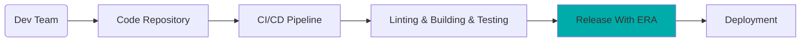

# ERA (**E**asy **R**elease **A**utomation)

Imagine reducing the time and complexity of managing multiple software releases with a single click.
That's exactly what the ERA tool does - it streamlines the auto-tagging of 10 interdependent
repositories through an integrated CI pipeline.
This robust automation not only **saves us over four hours per release** but also simplifies our
release process, crucial for software project with frequent monthly updates.

ERA is an open source Python tool crafted to enhance efficiency and convenience in handling multiple
repository tags.

## Table of Contents

- [ERA (**E**asy **R**elease **A**utomation)](#era-easy-release-automation)
  - [Table of Contents](#table-of-contents)
  - [Requirements](#requirements)
  - [Quick Start Guide](#quick-start-guide)
  - [What is ERA?](#what-is-era)
  - [What is ERA not?](#what-is-era-not)
  - [ERA Release With Continuous Integration](#era-release-with-continuous-integration)
  - [Getting Started](#getting-started)
  - [Additional Documentation](#additional-documentation)
  - [FAQ](#faq)
    - [What Should I Know Before Using ERA?](#what-should-i-know-before-using-era)
    - [Does ERA Natively Run On Windows?](#does-era-natively-run-on-windows)

## Requirements

- Windows Subsystem for Linux (WSL2)
- Ubuntu Version 20.04 LTS or higher
- Python Version 3.9 or higher

## Quick Start Guide

Explore the [ERA Getting Started For End Users](doc/getting_started_end_user.md).
This hands-on tutorial will guide you through releasing ERA and then applying it to your own Git
repository project, all within approximately one hour.

## What is ERA?

- ERA has a `easy-release-automation` CLI entry point which utilizes a `release-config.yml` file.
  - For an example, see [Release-Config Example](./era/release-config.yml).
- Modifies, verifies, and tags the repositories defined in `release-config.yml`.
- Executes customize actions via plugins specified in `release-config.yml`.
- Provides flexibility for various use cases in automating the release process.
- Requires two branches per repository (customized via `release-config.yml`):
  - Default branch names: `main` and `stable`.

ERA automatically generates the following **three commit messages for each repository during the release process**:

```bash
    Main branch (Merge Commit from stable into main)
    │
    ├─ chore: :wastebasket: ERA: Preparation for merging back into main with the plugin(s): changelog_unreleased_setter

    Stable branch (Commit for Tag 0.1.0)
    │
    ├─ chore: :bookmark: ERA: Release-Commit for Version: 0.1.0

    Stable branch (Commit for modification based on defined plugins in release-config.yml)
    │
    ├─ chore: :white_check_mark: ERA: Modification with the plugin(s): changelog_version_updater, yaml_updater
    │  and Validation with the plugin(s): validate_changelog 
```

## What is ERA not?

ERA is not responsible for the following tasks:

1. Building and deploying a package from the source code.
2. Integrating manual testing during the release process.
3. Testing created packages on end-devices or in cloud environment.

## ERA Release With Continuous Integration

ERA is a practical tool that can be integrated into a Continuous Integration (CI) environment,
such as GitHub, GitLab, or Azure pipelines.
The following diagram illustrates a possible flow for integrating ERA into a CI pipeline within
the `Release With ERA` step to ensure smooth and consistent tagging:



**Diagram 1:** _ERA CI for Release Automation_

## Getting Started

- [ERA Project Integration Guide](./doc/project_integration.md)
- [ERA Getting Started For Developers](doc/getting_started_developer.md)

## Additional Documentation

- [How does ERA work?](./doc/overview.md)
- [Feature Matrix](./doc/features.md)

## FAQ

### What Should I Know Before Using ERA?

- Basics of using Git
- Basics of GitFlow

### Does ERA Natively Run On Windows?

ERA is primarily developed and used on Linux developer machines (see `scripts/setup-era.sh`) or in CI environment with Linux agents.

ERA operates in the following environments:

1. ERA is supported on Ubuntu 20.04 or higher and on WSL2.
2. ERA was tested on Ubuntu 20.04 and on WSL2 on Windows machines.
3. ERA is not tested on native Windows machines.
