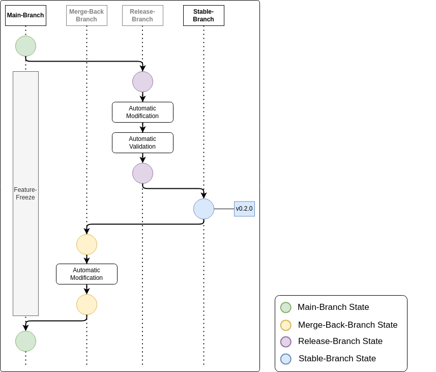
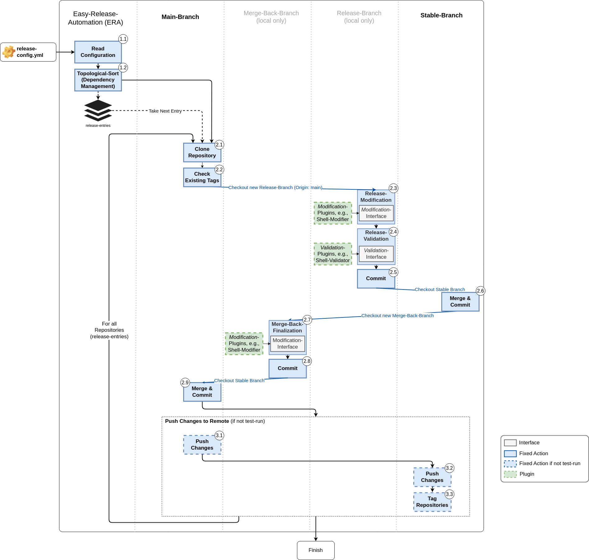

# ERA Overview

Releasing software can quickly become a effortful, time-consuming, and error-prune, especially in
projects with multiple interdependent repositories.
Following well-known release processes such as [GIT-flow](https://www.atlassian.com/git/tutorials/comparing-workflows/gitflow-workflow),
the developer has to follow conventions for generating branches and setting tags.
ERA is a tool to automate these steps, and in addition, allows the developer to
define plugins for

- modifications such as Changelog.md or dependency updates
- validation using automated test tools

of the repository. This makes ERA flexible enough to adapt to many use cases for automating the
release-process.

## 1.1 Branching Scheme

ERA is oriented on the [GIT-flow](https://www.atlassian.com/git/tutorials/comparing-workflows/gitflow-workflow)
 approach and focusses on 4 branches:

- **Main**-branch: the *Main*-branch is where the development takes place. Developers create
  *Feature*-branches from the *Main*-branch, and developers integrate new features by setting a
  merge-request from the *Feature*-branch to the *Main*-branch.
- **Stable**-branch: The *Stable*-branch contains the tags for the released versions.
- **Release**-branch: The *Release*-branch is a temporal branch, that is generated from the
  *Main*-branch. In ERA, users can apply automated modification- and validation-steps. After performing
  these steps, the *Release*-branch will be merged into the *Stable*-branch.
- **Merge-Back**-branch: The *Merge-Back*-branch is an temporal branch that connects the *Stable*-branch
  and *Main*-branch. It allows for last modification-steps before merging the *Stable*-branch
  back into the *Main*-branch.

The following graph provides a concise overview of the branching model oriented on the of GIT-Flow
branching model:

**Diagram 1:** ERA branching scheme

**NOTE**: as shown above, ERA does not allow to update the *Main*-branch during the release.
This constraint is inevitable, as ERA automates the merge-process. We do not consider it
as major drawback, as ERA's release cycle will take from minutes to at most hours, depending on the 
plugins in use. If the feature-freeze collides with your current release-process, please
see section *1.4. Known Drawbacks* for possible workarounds.

## 1.2 Release-Configuration

Releases with ERA are configured through a single configuration file called `release-config.yml`.
This release configuration is split into two sections:

- `global_config`: defines a global configuration that is applied to the release process of all repositories.
- `repository`: defines a list of `release-entries`, where each `release-entry` configures the release
  of a single repository.

During the release-process, ERA will iterate over all `release-entries`, for releasing each repository
individually.

For more configuration details of the `release-config.yml` see [ERA Project Integration Guide](./project_integration.md).

## 1.3 ERA Process Overview

The ERA process provides a fixed automated branching and tagging mechanism, that follows the
branching scheme described under section *1.1*.

The flexibility of ERA comes from providing a plugin mechanism, where the developer can specify
which plugins are executed to modify and validate the repository.

For the plugins, ERA defines two Interfaces:

- `Modification`-Interface: The developer can specify custom plugins, that modify the
  *Release*-branch or *Merge-Back*-branch.
- `Validation`-Interface: The developer can specify custom plugins, that validate/test the
  *Release*-branch.

Which plugins are executed is configured in the repository's `release-entry` in the
`release-config.yml`. See [ERA Project Integration Guide](./project_integration.md) for more
information.

The following graph describes the steps of the release process in detail, where encircled numbers are
referenced in the description below.

**Diagram 2:** ERA process overview

- **1. Preprocessing:**
  - *1.1.* ERA reads in the `release-config.yml`, which configures the release-process.
  - *1.2.* ERA sorts the `release-entries` regarding their dependencies, i.e., if repo-A depends on
    repo-B, repo-B will be released before repo-A.
- **2. Local Release:**
  - *2.1.* ERA takes the next `release-entry` from the staple and clones the corresponding repository.
    - **NOTE**: All repositories are cloned into relative path `.era-repositories/`
  - *2.2.* ERA validates, if the git-tag for the `release-entry` already exists. If the tag exists and
    - `tag-policy="skip"`, ERA will skip the release and continue with the next
      `release-entry` at step *2.1*.
    - `tag-policy="ovr"`, ERA will remove the existing tag form the repository and continue with the
      current `release-entry`.
  - *2.3.* ERA checks out the *Release*-branch and performs the `Release-Modification`-step, which
    executes `Modification`-plugins.
  - *2.4.* ERA performs the `Release-Validation`-step, which executes `Validation`-plugins.
  - *2.5.* ERA commits the changes of the *Release*-branch.
  - *2.6.* ERA merges the *Release*-branch into the *Stable*-branch and commits the changes.
  - *2.7.* ERA checks out the *Merge-Back*-branch and performs the
    `Merge-Back-Finalization`-step, which executes `Modification`-plugins.
  - *2.8.* ERA commits the changes of the *Merge-Back*-branch.
  - *2.9.* ERA merges the *Merge-Back*-branch into the *Main*-branch and commits the
    changes.
- **3. Push Changes To Remote** *(Not executed during test-run)*
  - *3.1.* ERA pushes the changes of the *Main*-branch to remote.
  - *3.2.* ERA pushes the changes of the *Stable*-branch to remote.
  - *3.3.* ERA pushes tags the *Stable*-branch.

## 1.4. Known Drawbacks

### 1.4.1 Hand-Testing

- **Drawback**:
    When releasing software, it might be often desireable to hand-test the a state before releasing it.
    Unfortunately, ERA is not able to split the release-process into generating a testable version 
    and continuing the release process afterwards.
- **Source of Problem**:
    During hand-testing, the *Main*-branch (on which developers can continuously develop) might have
    new commits. This might lead to merge-conflicts that can not be resolved in an automated fashion.
- **Workaround 1**:
    Freeze all *Main*-branch for the time of hand testing. This allows to generate a 
    pre-release/release-candidate, that can be hand-tested. As the *Main*-branch is frozen for the testing time,
    the main branch is can be released in a second cycle with release tags.
- **Workaround 2**:
    Sometimes it might not be possible to freeze the *Main*-branch. Therefore, one can imitate a 
    frozen main-branch and main generate a *Main-Freeze* branch. Steps:
    1. Generate a *Main-Freeze*-branch originating from the *Main*-branch.
    2. Run the  ERA release process with the *Main-Freeze*-branch instead of the original
        *Main*-branch and release-candidate tags.
    3. Test the tagged-release.
    4. Run the  ERA release process again with the *Main-Freeze*-branch and use actual release tags.
    5. Merge back the *Main-Freeze*-branch into the main-branch.

### 1.4.2. Hot-Fixes

- **Drawback**
    Although the developer might have run all his automated tests (and hand-tests), there might be
    still bugs in the software. Unfortunately, it is often not possible to use the *Main*-branch to
    fix this bug as the *Main*-branch might already be in a later state with new features.
    Therefore, the developer has to generate a *Hot-Fix*-branch from the latest release and fix the 
    bug on the *Hot-Fix*-branch. However, this is currently not supported by ERA, as the final merge
    back still needs to be done into *Main*-branch, which in turn might lead to merge conflicts.

- **Workaround**:
    One way to deal with *Hot-Fix*-branch is to use the *Hot-Fix*-branch as *Main*-branch for the 
    automated release process. This way the final merge-back will be a merge-back back into the 
    *Hot-Fix*-branch. In order to percept the bug-fix later on in the *Main*-branch, the
    *Hot-Fix*-branch then can be manually merged into the *Main*-branch.